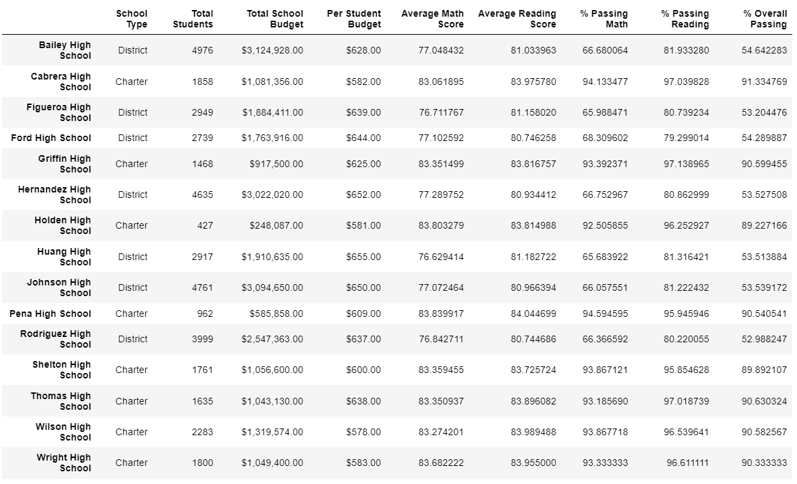

# PyCitySchool_Analysis

## Overview
The purpose of the analysis is to analyze the school performance in Math and Reading scores.

## Results
Before

After

After replacing the Math and Reading passing percentage for THS, the passing rate increases from 60%+ to 90%+.